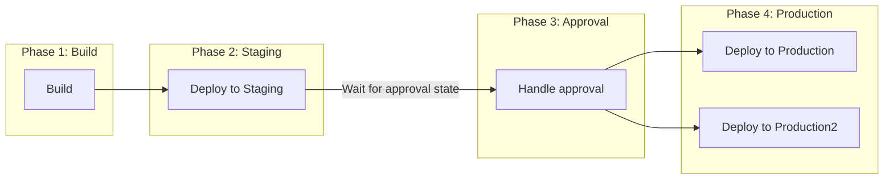

# Approvals

## High Level

This example demonstrates a four-phase release process where production deploys require explicit approval before proceeding.



## Four-Phase Structure

The release process is organized into four sequential phases:

1. **Build Phase**: Builds an artifact
2. **Staging Phase**: Deploys to all staging environments
3. **Production Approval Phase**: Waits for manual approval via custom state
4. **Production Phase**: Deploys to all production environments after approval

Each phase must complete successfully before the next phase can begin.

## Approval Process

Approvals are handled through Ocuroot's custom state mechanism. The approval phase references a custom state at `./custom/approval` that must be manually set before the production phase can proceed.

### How to Approve a Release

1. **Review the staging deployment**: Ensure the staging phase completed successfully and the application is working as expected

2. **Set the approval state**: Use the Ocuroot CLI to set the custom approval state:

```bash
ocuroot state set ./release.ocu.star/@<release>/custom/approval "approved"
```

3. **Apply the intent**: Once the state is set, apply the intent to allow the production phase to proceed:

```bash
ocuroot state apply ./release.ocu.star/@<release>/custom/approval
```