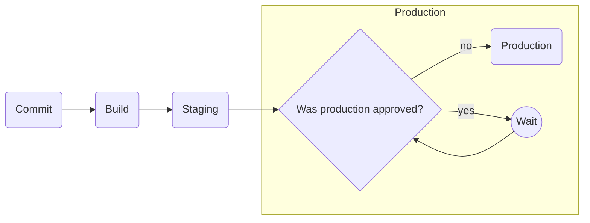
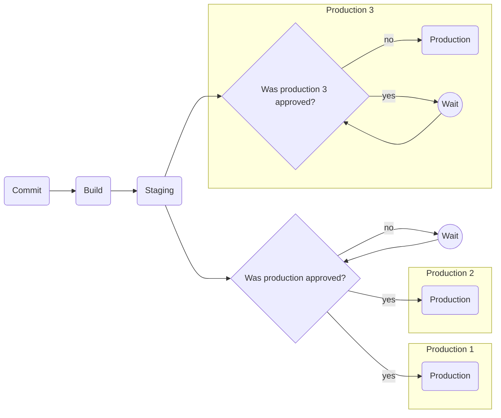

# Approvals

## High Level

Production deploys must wait until the build has been approved.

## Multiple approvals

It should be possible to approve multiple environments in bulk, or have specific environments requiring separate approval.

## Obtaining approvals

Approvals must be provided by a human. The approval must be tied to a specific build.

It should be possible to control *who* can approve something. This can vary depending on user id, etc.

Approvals should include some kind of signature.

Should approvals be revokable? What happens if an approval is revoked?