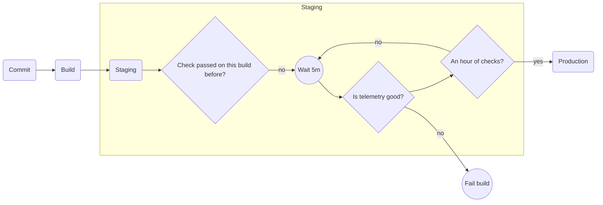

# Bake Time

This pattern involves leaving a build deployed to a staging environment for a specific amount of time to ensure that it is stable.

## Simple example

This model implies that the staging deployment will be "in progress" for at least an hour. Builds will continue to stack up while the staging deployment is in progress. Should we even bother to do the builds?

If a later build fails, but there are incomplete builds in between, maybe you could bisect to get some changes out.

## Failing Fast

Avoid congestion when you have a lot of builds stacked up waiting for an hour. Allow fast failures.

This model will run repeated checks of the telemetry at regular intervals.
This will enable fast failures and unblock replacing with a "good" build.