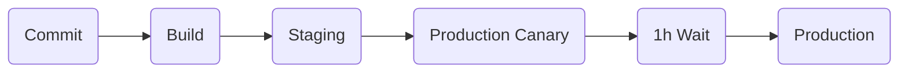
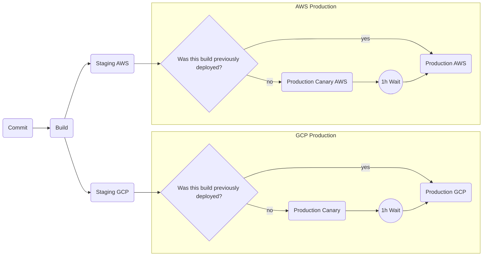

# A simple example

```mermaid
graph LR
    C(Commit) --> B(Build)
    B(Build) --> S(Staging)
    S --> PC(Production Canary)
    PC --> W(1h Wait)
    W --> P(Production)
```

# A more complex example

```mermaid
graph LR
    C(Commit) --> B(Build)
    B(Build) --> SG(Staging GCP)
    B(Build) --> SA(Staging AWS)

    SG --> PGD
    subgraph GCP Production
        direction LR
        PG.C(Production Canary)

        PGD{Was this build previously deployed?} -- no --> PG.C
        PGD -- yes --> PG.P
        PG.C --> PG.W((1h Wait))
        PG.W --> PG.P(Production GCP)
    end

    SA --> PAD
    subgraph AWS Production
        direction LR
        PAD{Was this build previously deployed?} -- no --> PCA(Production Canary AWS)
        PAD -- yes --> PA.P
        PCA --> PA.W((1h Wait))
        PA.W --> PA.P(Production AWS)
    end
```

