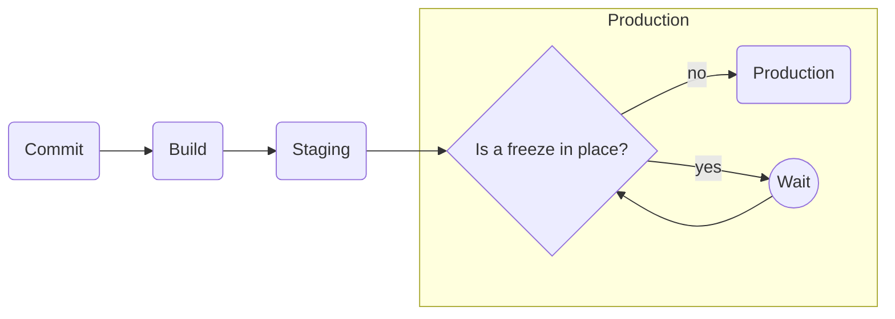
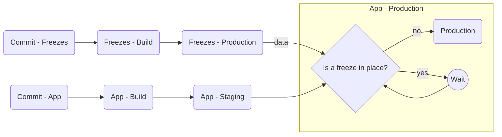

# A simple example

```mermaid
graph LR
    C(Commit) --> B(Build)
    B(Build) --> S(Staging)
    S --> PD
    subgraph Production
        direction LR
        PD{Is a freeze in place?}
        PD -- no --> P(Production)
        PD -- yes --> W((Wait))
        W --> PD
    end
```

# Getting freeze data

A list of freezes can be pushed as outputs of a deployment.
Team members can then control freezes through commits.

```mermaid
graph LR
    C2(Commit - Freezes) --> B2(Freezes - Build)
    B2 --> FP(Freezes - Production)
    FP -- data --> PD
    C(Commit - App) --> B(App - Build)
    B --> S(App - Staging)
    S --> PD
    subgraph App - Production
        direction LR
        PD{Is a freeze in place?}
        PD -- no --> P(Production)
        PD -- yes --> W((Wait))
        W --> PD
    end
```