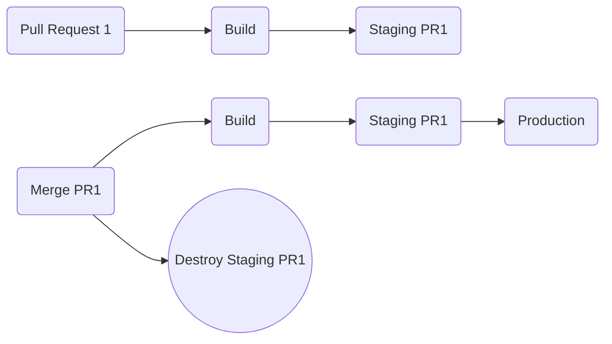

# Ephemeral Environments

Ephemeral environments can be created and destroyed on demand. You may want to create one for a pull request to allow testing.

This is the "happy path" but there will be situations where a pull request is closed or abandoned. So there should probably also be a maximum lifetime for an ephemeral environment.