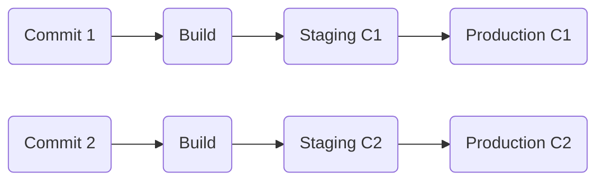

# Multiple Instances

It should be possible to deploy multiple instances of a package at once.

```mermaid
graph LR
    C1(Commit 1) --> B1(Build)
    C2(Commit 2) --> B2(Build)
    B1 --> S1(Staging C1)
    B2 --> S2(Staging C2)
    S1 --> P1(Production C1)
    S2 --> P2(Production C2)
```

Each deployment will continue to exist until it is explicitly removed.
