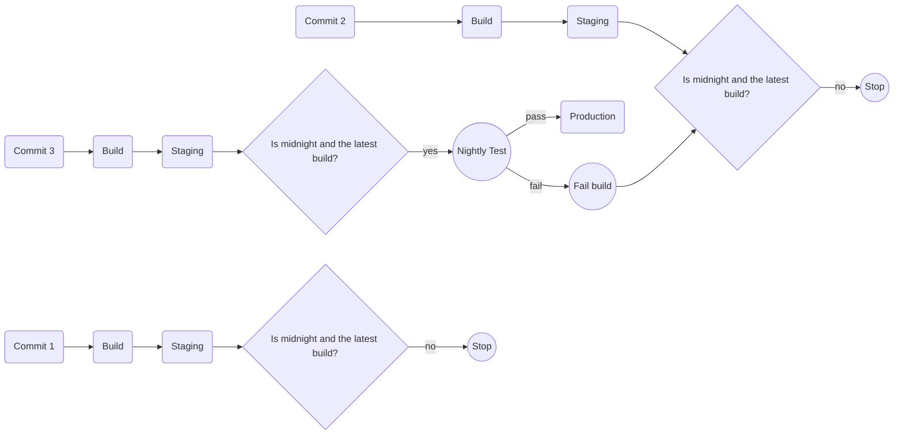

# Nightly Acceptance

Some acceptance runs can take a long time, including performance testing or large numbers of actions.

In these cases, you might want to only run the acceptance test suite once per night.

But you have multiple builds stacked up waiting for the acceptance test suite to run. Which one do you run against and what happens if something goes wrong?

The latest build can be considered to be the most recent successful build for the package.

Failing the build should automatically result in attempting with the next latest build.

The pipelines for Commit 1 and Commit 2 are considered "superceded" unless Commit 3 fails.